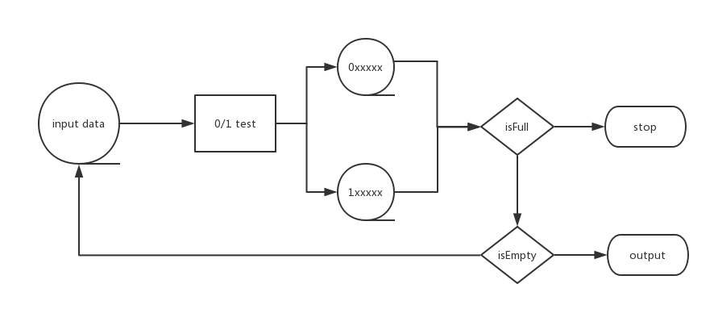

# 阅读笔记

## 第一章

第一章用一个对磁盘文件进行归并排序的问题进行切入，并且严格限制了内存使用的大小和程序运行的时间。

如果默认我们需要对一个32位的整数进行排序，那么多路归并排序就成为了唯一的选择。

事实上，如果对问题的实际应用场景进行分析，我们也许会得到一些能够简化问题的信息，在这一章中的一个好消息是每个数字都小于一千万，而且不会重复，这样首先想到可以用更少的位去表示这些数字。但是即便用7个字节存储每一个数，仍然不能将这些数据一次性在内存中装下，但是按位存给了我们一个提示，就是用位去表征一个数。那么久自然想到用一个位表示一个数。将可用的1MB的内存转化为一个有800多万个可用位的位向量，从左往右分别代表0,1,2...，但是800万个可用位显然存不下1000万个数，所以看上去一趟算法并不能实现将1000万个数完全排序。

因此我们需要想一想1000万个数据如何高效的存储，根据信息论的知识，如果单纯的把一个数用1bit来存，1MB的空间显然是不够的，这种情况就在问题5中进行了思考。

最后在“简单的设计”里面有一句话说的很好“设计者确定其设计已经达到了完美的标准不是不能在增加任何东西，而是不能再减少任何东西...简单的程序通常比具有相同的功能的复杂程序更可靠、更健壮、更高效。而且易于实现和维护”。想起《吕氏春秋》的“一字千金”，都是将要表达的信息用尽可能少的可见载体呈现。

## 第二章

第二章开篇提出了三个问题

* 给定一个最多包含40亿个随机排列的21位整数，找出一个不在文件中的32位整数
  * 在足够的内存情况下，如何解决该问题
  * 内存很少，但是有几个外部的“临时”文件可用，如何解决该问题
* 将一个n元向量向左旋转i个位置。例如，当n=8，i=3时，向量abcdefgh旋转为defghabc。如何使用数十个额外字节的存储空间，在正比于n的时间完成向量的旋转
* 给定一个英语词典，找出其中的所有变位词的结合。例如"pots","stops","tops"互为变位词

### 问题1

(1) 在内存足够的情况下，可以使用位向量的方法表征每一个出现的数，至少需要512Mb的内存空间存储时间复杂度是O(n)

(2) 内存不足的情况

内存不足的情况下，对于输入的数据，先根据最高位按照0和1进行划分，写到两个文件中，文件名是“0”和“1”，然后看这两个文件中的数是否是2^32个，如果有一个不满，说明有缺的数，那么把这个文件的数作为输入进行"0/1"探测，一直这样进行下去，知道发现“0/1”探测的结果中有一个文件为空，说明当前位没有数据，这样就能找到不存在的数

答案中说算法复杂度在O(nlgn)，但我觉得因为每次是将空间折半

如果是要找到0和1文件中多个不存在的数，那么对0和1的文件都进行探测，用主定理法
> T(n) = 2T(n/2) + n

可以得到复杂度确实是O(nlgn)

但是如果只是要找到一个不存在的数，只需要对一个文件(数量少的)进行探测
> T(n) = T(n/2) + n

用主定理法可以得到T(n) = O(n)，更加确切的$T(n) = n + \frac{n}{2} + \frac{n}{4} + ... + 1​$ = $n (1 + \frac{1}{2} + \frac{1}{4} + ... + (\frac{1}{2})^{lgn})​$ = n $\frac{1-(\frac{1}{2})^{lgn+1}}{1-\frac{1}{2}}​$ = $n(2-\frac{1}{n}) = 2n-1​$

<center></center>

### 问题2

这个问题关键要找到技巧，先分析一下问题，相当于有两个相邻的块，现在要交换它们的位置。一个最简单的方法是开辟一个新的空间，将其中的一块暂存起来，之后把第二块往前移，最后把暂存起来的第一块放到相应的位置上去。

如果块很大而可用的空间很少，就需要一些精巧的方法，一种巧妙的实现是通过三次翻转完成的

```Java
public static void swap(char[] str, int from, int to){
  for(int i = from,j = to; i < j; i++,j--){
    char tmp = str[i];
    str[i] = str[j];
    str[j] = tmp;
  }
}

public static void main(String[] args){
  char[] str = {'a','b','c','d','e','f','g','h'};
  swap(str, 0, 2);
  swap(str, 3, 7);
  swap(str, 0, 7);
}
```

### 问题3

问题三感觉可以将字典中的每一个单词按照字典序排序，然后相同的变位词得到的排序结果一样

### 小结

不是随便什么人都会灵机一动的，我记得[《暗时间》](http://mindhacks.cn/)一书中曾经提到“关于学习密度和专注力”的问题，持续保持思考状态很重要，无形中就可以多很多可以利用的时间。这应该才是灵机一动的源泉。

在回到这一章中，这一章着重要掌握的还是二分查找的思想，二分查找的具体实现在第九章中仔细研究。二分为什么应用的如此广泛呢，不光是在计算机科学，在现实生活中，一个十进制的世界里面，人们也会将问题二分化，一般演变为两方的势力对决，但是三极、甚至更多(战国、三国时期)的持续时间很短暂，而且只要有一极解体，原有的格局便不复存在了。“2”这个数字为什么这么特殊，这个问题我一直没有想明白。是因为我们习惯用“二分”的眼光去看待事物的吗？

## 第三章

说了半天的反面教材，概括起来就是能写短的程序就不要写长的程序。

现在许多语言都提倡函数式编程，可以说将这方面的思想发挥到了极致，然而程序写的越短，可读性就降低了，需要补很多注释，也是编程人员最头疼的地方，注释是写给别人看的不是自己看的。
