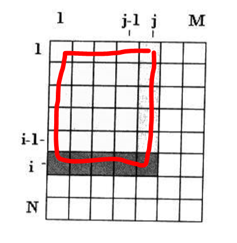
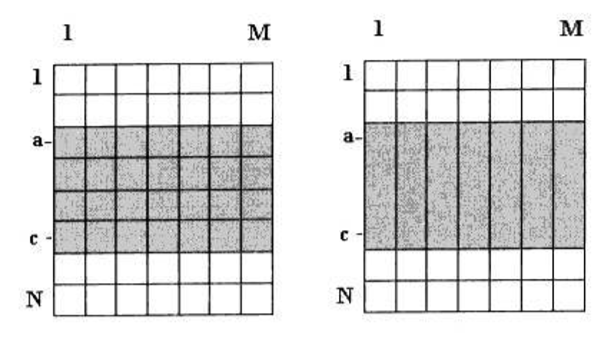

# 算法设计技术

## 问题10

想要找到的是总和最接近0的子向量，或者最接近实数t，应该如何变化？

最接近0的问题，可以看做是求和之后的绝对值最小，最接近t可以看做是求和之后与t的差的绝对值最小

## 问题13
对于二维数组mxn的情况，如何求解矩形子数组的最大和

首先可以预计算部分和，PS[i][j]表示下图中红色标出的一张整块数的和，

> PS[i][j] = PS[i][j-1] + PS[i-1][j] - PS[i-1][j-1] + arr[i][j]

然后可以将问题降维，假设我们已经知道了最大子数组在第a行到第c行之间，那么可以把每一列的数求和之后看做一个整体，然后运用一维求最大子数组之和的方法求解

这样总体的时间复杂度为O(N \* M \* min(N, M))

## 问题14
给定整数m, n和实数向量x\[n\]，找出使总和x\[i\]+...+x\[i+m\]最接近0的整数i(0 <= i < n-m)

解题的两个要点，1)最接近0的整数可以看做是绝对值最小，2)给定m之后，i每增加一个，相当于进去了i+m+1，出来了i，因此只需做差

## 问题15

当T(1) = 0且n为2的幂时，递推公式 T(n) = 2T(n/2) + cn的解是什么？用数学归纳法证明结果，如果T(1) = c结果是什么

T(1) = 0的情况，先枚举一下

> T(1) = 0, T(2) = 2c, T(4) = 4c, T(8) = 24c...

分析可以得到

> T(1) = c * 2^0 * 0, T(2) = c * 2^2 * 1, T(4) = c * 2^2 * 2, T(8) = c * 2^3 * 3...

那么通项公式T(n) = cnlgn，数学归纳法证明略

当T(1) = c且n为2的幂时，先枚举一下

> T(1) = c, T(2) = 4c, T(4) = 12c, T(8) = 32c...

分析可以得到

> T(1) = c * 2^0 * 1, T(2) = c * 2^2 * 2, T(4) = c * 2^2 * 3, T(8) = c * 2^3 * 4...

那么通项公式T(n) = cn(lgn + 1)，数学归纳法证明略
